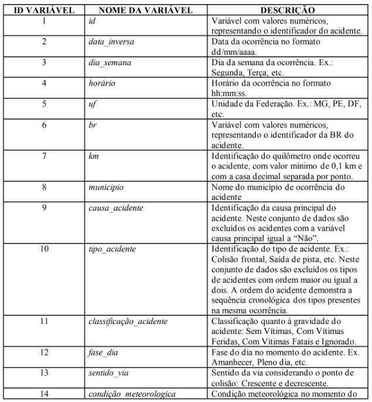
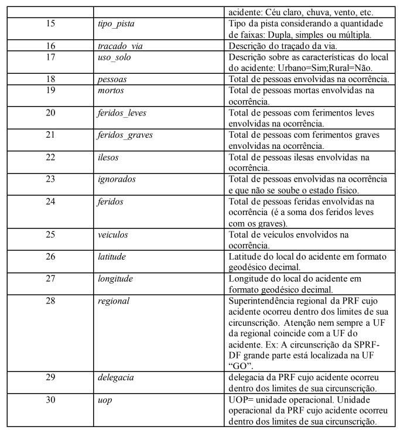

# **Análise Exploratória de Dados — Acidentes de Trânsito em Rodovias Federais do Brasil (2014–2024)**

Este projeto compreende a EDA (*Exploratory Data Analysis*) da Base de Dados de Acidentes de Trânsito em Rodovias Federais Brasileiras, cobrindo o período de **2014 a 2024**, com base em dados abertos da PRF (Polícia Rodoviária Federal). O objetivo é fornecer uma base limpa e pronta para análises, com foco em estatísticas anuais, causas, tipos de acidentes e distribuição geográfica.

Acidentes de trânsito causam milhares de mortes e prejuízos no Brasil todos os anos, portanto este projeto de EDA trás informações essenciais para identificar padrões, apoiar decisões de segurança viária e orientar ações que salvam vidas.

O projeto foi desenvolvido em Python com Pandas e Matplotlib.

O projeto realiza:
- Estatísticas anuais de acidentes  
- Tipos e causas mais frequentes  
- Distribuição geográfica dos acidentes  
- Gráficos de tendências e correlações  
- Identificação de padrões relevantes para segurança viária.

A fonte dos dados é pública: Polícia Rodoviária Federal (PRF)

https://www.gov.br/prf/pt-br/acesso-a-informacao/dados-abertos/dados-abertos-da-prf

## 📊 Estrutura dos Dados

O conjunto de dados contém **947.863 linhas e 30 colunas**, incluindo informações como:

- ID do acidente  
- Data e hora  
- Local do acidente (rodovia, km, cidade, estado)  
- Tipo e causa do acidente  
- Número de veículos envolvidos  
- Número de vítimas (feridos e mortos)  
- Outras variáveis categóricas e numéricas que descrevem a ocorrência.  

Cada linha representa um acidente registrado na base da PRF.

O arquivo completo (220MB) pode ser baixado aqui: [https://www.kaggle.com/datasets/alinebertolani/federal-highway-accidents-dataset]

## Dicionário dos Dados

